# 👋 Hi there, I'm Adam

Just a guy who likes to drink coffee ☕ crafting simple software solutions to complex real-world 🌎 problems.

Not an IT prodigy, not even a PC until adulthood, not that it matters, suffering, & independently recovering & 
rehabilitating from years of multiple severe injuries, including total loss of not just memory but all skills & senses, 
including motor to complement paralyses, etc. Not even in the sociotechnical emergence of AI, nor a PC today, nor ever for long
with ongoing 24/7 epic plagues of random wrongdoing insanity continuing to harass my every breath eternal, global. 
Too much to remember, spanning longer than average human memory, anyway - extreme machinations since early childhood to be precise.

<!-- START: REPO-PINS -->
  
  
  
<!-- END: REPO-PINS -->

# Fun facts

Frankly, should be not fun facts, but here goes:

A couple decades ago, EM was sleeping on an office floor, or was it a futon? A couple decades ago I was purchasing a kebab/souvlaki & eating it too when noticing EM awkwardly gawking at me from behind a computer game shop counter next to food court, back to customers (if any that eon); like backward window shopping the real world. How do I know? - the randomness, posture, intensity, & eccentric promoting & elaborating of Paypal as a viable investment solution. A couple decades ago I was also sleeping on a futon on a sloped garage floor, or sauna, but was a real kid.

Basically, I completed enough credits for two master's degrees before graduating with any bachelor's, which is only not two itself if not for delays to leave just as I entered; double requirements for less than half rights under the most adverse of circumstances. As if that wasn't insane enough, I had to spend longer than it takes someone as me to complete a double degree single-handedly "challenging" not just that but all history in retrospect with an already minimum double workload without any degree (or memory) to support me to end just as it begun; not really being there (or online by then), & a formal declaration of them not doing anything (but laugh with my money & rights).
