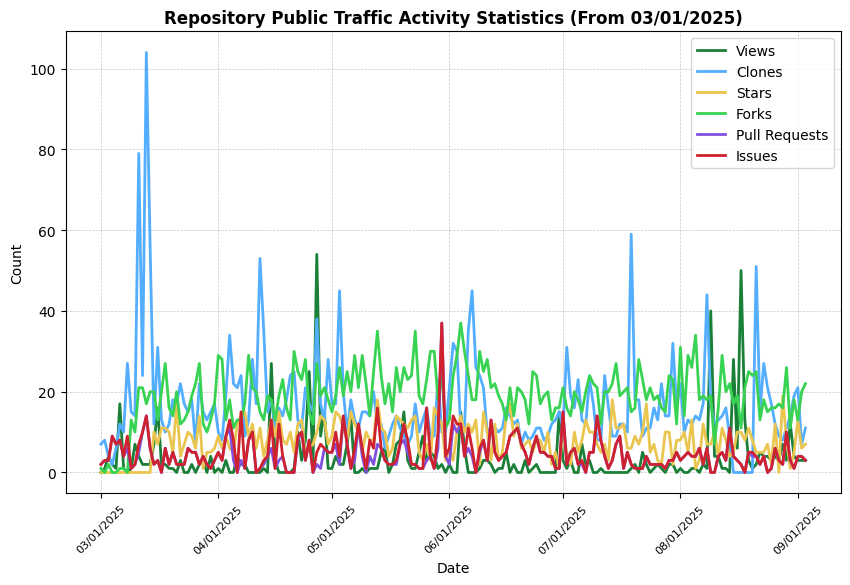

# 👋 Hi there, I'm Adam

 

_just a guy who likes to drink coffee_ ☕ _crafting simple software solutions to complex real_ 🌎 _problems_

_recovering from severe injuries (including total amnesia, paralyses, internals, sense, stab/projectile/foreign-body, & now years of multiple infections head-to-toe corresponding with device damages, etc, etc, etc) & epic_ 🌎 _24/7 genocidal plagues (since childhood_ 🤷)

<!-- * 🎓 focus: [software engineering, computer & other advanced data engineering and sciences](https://github.com/University-Project-Repos) (& GIS & more!) -->

## 📈 Repository and User Contribution Statistics

<!-- Weekly generated visualizations of my GitHub user & repository statistics: -->

> _My Avg contributions mostly include [uni projects](https://github.com/University-Project-Repos), and exclude non-collab, minor roles (open-source, lead), etc_

<!--

### 🌱 Badges

  
  
  

-->

<!--REPO_ACTIVITY_STATS_START-->

<!--REPO_ACTIVITY_STATS_END-->

Better late than never
