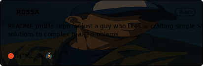

# 👋 Hi there, I'm Adam

Just a guy who likes coffee ☕ crafting simple software solutions to complex real-world 🌎 problems. Code for the people.

<!-- START: REPO-PINS -->
  
  
  
<!-- END: REPO-PINS -->
